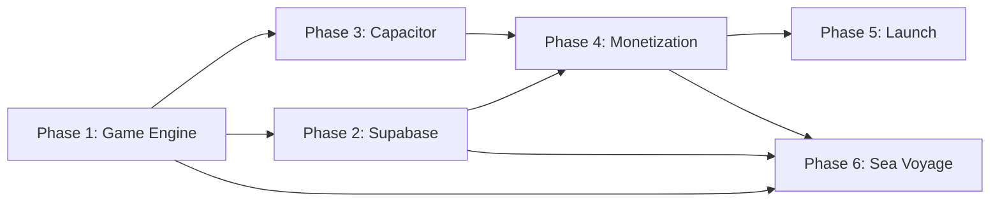

# 🏴‍☠️ PLAN: Cannon Cove — Project Plan

> Pirate-themed artillery game. Web-first, then mobile + backend.

---

## Overview

Build **Cannon Cove**, a cross-platform artillery game inspired by QBasic Gorillas with a pirate theme, using the **Game-First, Layer Up** approach (Option B from brainstorm). Each phase delivers a testable milestone.

**Total estimated timeline:** 6 weeks (Part-time) / 3 weeks (Full-time)

---

## Phase 1: Core Game Engine

> **Goal:** A fully playable single-player web game with no backend dependencies.
> **Agent:** `@game-developer` + `@frontend-specialist`
> **Duration:** ~2 weeks

### 1.1 Project Scaffold

- [x] Initialize Vite project with vanilla JS template
- [x] Set up file structure per the concept doc (`game.js`, `renderer.js`, `ai.js`, `waves.js`, `audio.js`)
- [x] Configure Canvas 2D with DPI-aware scaling and resize listener
- [x] Set up Pirata One + Inter fonts (Google Fonts)
- [x] Create base CSS with pirate color palette (`#0B1D3A`, `#F4A623`, `#8B5E3C`, `#F5F0E8`)

### 1.2 Rendering Engine (`renderer.js`)

- [x] Draw ocean background with gradient sky
- [x] Procedural wave generation (animated sine waves)
- [x] Draw pirate ships (procedural canvas — hull, mast, sails, flag)
- [x] Ship bobbing animation (position = `baseY + sin(time * freq) * amp`)
- [x] Wind flag indicator (direction + speed visualization)
- [x] Dynamic sky cycle (sunset → dusk → night over match duration)
- [x] Star field generation for night phase
- [x] Cannonball rendering with smoke trail
- [x] Splash VFX (water hit) and impact VFX (ship hit)
- [x] Ship damage states (3HP → 2HP → 1HP → sinking animation)
- [x] Rocky islands / cove scenery decoration
- [x] Easter egg: occasional whale breach or kraken tentacle in background

### 1.3 Physics & Game Logic (`game.js`)

- [x] Core game state object (players, turn, wind, round, HP)
- [x] Finite State Machine for game flow (`MENU → AIM → FIRE → RESOLVE → SWITCH_TURN → VICTORY`)
- [x] Projectile physics (gravity + wind + initial velocity)
- [x] Wave offset applied to ship Y positions for collision detection
- [x] Collision detection (cannonball vs. ship hull, water, rocks, power-up crates)
- [x] Multi-hit health system (3HP per ship)
- [x] Wind randomization per round
- [x] Turn switching logic
- [x] Victory/defeat state with celebration animation

### 1.4 Input & Controls

- [x] Mouse/trackpad: drag to set angle + power
- [x] Touch controls: same drag gesture for mobile web
- [x] Power gauge UI overlay
- [x] Angle indicator arc
- [x] Fire button

### 1.5 AI Opponent (`ai.js`)

- [x] Monte Carlo simulation (N random throws, pick closest to enemy)
- [x] Wave phase prediction (account for target ship bobbing)
- [x] Progressive difficulty (`2 + round * 3` simulations)
- [x] Named AI captains with personality (affects accuracy variance)

### 1.6 Power-Ups

- [x] Floating crate spawning (randomly between ships)
- [x] Crate collision detection
- [x] 🔴 Chain Shot — double damage on next hit
- [x] 🟢 Repair Kit — restore 1 HP
- [x] 🔵 Spyglass — show exact trajectory preview for one turn

### 1.7 Audio (`audio.js`)

- [x] Integrate Howler.js for audio management
- [x] Cannon fire SFX
- [x] Cannonball whoosh (positional)
- [x] Water splash SFX
- [x] Ship hit / wood cracking SFX
- [x] Ambient ocean loop
- [x] Victory fanfare
- [x] Wind ambient (intensity matches wind speed)

### 1.8 Game Modes

- [x] ⚔️ Duel — 1v1 vs AI (default)
- [x] 🏴‍☠️ Crew Battle — 2-player hot-seat
- [x] 👻 Ghost Fleet — AI vs AI autoplay

### 1.9 UI Screens

- [x] Main menu (title, mode selection, settings)
- [x] In-game HUD (HP bars, wind indicator, turn label, round counter)
- [x] Settings panel (sound toggle, quality)
- [x] Victory / defeat screen with stats
- [x] "How to Play" overlay

### ✅ Phase 1 Verification

| Test | Method | Pass Criteria |
|------|--------|---------------|
| Game loads | Open `localhost:5173` in browser | Canvas renders ocean, ships, sky |
| Physics accuracy | Fire at 45°, no wind — ball should arc symmetrically | Visual check + unit test |
| Wave bobbing | Ships move up/down at ~0.5Hz | Visual check |
| AI plays | Start Duel mode, wait for AI turn | AI fires within reasonable angle |
| Damage system | Hit a ship 3 times | Ship shows 3 damage states + sinks |
| Power-ups | Play 5+ turns | At least one crate should spawn |
| Touch controls | Open on mobile Safari/Chrome | Drag to aim works |
| All modes | Test Duel, Crew Battle, Ghost Fleet | All three work without errors |
| Audio plays | Fire cannon, hit ship, splash water | Sounds play at correct triggers |
| Dynamic sky | Play a full match (~10 turns) | Sky transitions from sunset to night |

---

## Phase 2: Supabase Backend

> **Goal:** Authenticated players, persistent profiles, and global leaderboard.
> **Agent:** `@backend-specialist`
> **Duration:** ~1 week

### 2.1 Supabase Project Setup

- [x] Create Supabase project
- [x] Configure auth providers (Anonymous, Google, Apple, magic link)
- [x] Set up environment variables (`VITE_SUPABASE_URL`, `VITE_SUPABASE_ANON_KEY`)

### 2.2 Database Schema

- [x] Create `players` table (id, username, avatar_url, total_wins, total_games, accuracy_pct, unlocked_skins)
- [x] Create `matches` table (id, player1_id, player2_id, winner_id, rounds, duration_seconds)
- [x] Create `leaderboard` materialized view (win_rate, rank)
- [x] Set up RLS policies (players can only update own profile, matches insert-only)
- [x] Create trigger to auto-update player stats on match insert

### 2.3 Auth Integration (`supabase.js`)

- [x] Supabase client initialization
- [x] "Play as Guest" → anonymous auth
- [x] "Sign In" → OAuth / magic link
- [x] Session persistence and token refresh
- [x] Guest-to-authenticated migration (transfer stats)

### 2.4 Game Integration

- [x] Save match results to `matches` table on game end
- [x] Update player `total_wins`, `total_games`, `accuracy_pct` after each match
- [x] Fetch and display leaderboard in UI
- [x] Cloud save: persist current game settings per player

### 2.5 Edge Functions

- [x] Anti-cheat score validation (verify match duration vs. rounds, reasonable accuracy)
- [x] Reward distribution (unlock skins at milestones)

### ✅ Phase 2 Verification

| Test | Method | Pass Criteria |
|------|--------|---------------|
| Guest auth | Click "Play as Guest" | Session created, game starts |
| OAuth auth | Click "Sign In with Google" | Redirect + session |
| Match saved | Complete a game | Row appears in `matches` table |
| Leaderboard | Win 5+ games | Player appears on leaderboard with rank |
| RLS | Try to update another player via API | Blocked by policy |
| Guest migration | Play as guest, then sign in | Stats transfer to authenticated account |

---

## Phase 3: Mobile (Capacitor)

> **Goal:** Native iOS + Android apps wrapping the web game.
> **Agent:** `@mobile-developer`
> **Duration:** ~1 week

### 3.1 Capacitor Setup

- [ ] Install Capacitor CLI and core plugins
- [ ] Configure `capacitor.config.ts` (app name, bundle ID, server settings)
- [ ] Generate iOS and Android projects
- [ ] Configure splash screen and app icons

### 3.2 Touch Optimization

- [ ] Verify drag-to-aim feels natural on touch
- [ ] Adjust hit areas for fat-finger tolerance
- [ ] Add haptic feedback on cannon fire and ship hit (`@capacitor/haptics`)
- [ ] Prevent accidental zooming / scrolling

### 3.3 Native Integrations

- [ ] `@capacitor/preferences` — local settings storage
- [ ] `@capacitor/share` — victory screenshot sharing
- [ ] `@capacitor/splash-screen` — branded loading

### 3.4 Platform Testing

- [ ] Test on iOS simulator (iPhone 15, iPad)
- [ ] Test on Android emulator (Pixel 8, Samsung Galaxy)
- [ ] Test landscape and portrait orientations
- [ ] Verify Canvas performance on mid-range devices

### ✅ Phase 3 Verification

| Test | Method | Pass Criteria |
|------|--------|---------------|
| iOS build | `npx cap run ios` | Game runs on iOS simulator |
| Android build | `npx cap run android` | Game runs on Android emulator |
| Haptics | Fire cannon on device | Phone vibrates |
| Share | Win a game, tap Share | Native share sheet opens with screenshot |
| Performance | Play full match on mid-range device | Smooth 60fps, no frame drops |

---

## Phase 4: Monetization

> **Goal:** Rewarded video ads as the sole unlock mechanism — no paid purchases.
> **Agent:** `@backend-specialist` + `@mobile-developer`
> **Duration:** ~1 week

### 4.1 AdMob (`ads.js`)

- [ ] Install `@capacitor-community/admob`
- [ ] Rewarded video: "Watch to unlock power-up" prompt
- [ ] Rewarded video: "Watch for second chance" on defeat
- [ ] Rewarded video: "Watch to unlock ship skin" in cosmetic shop
- [ ] Rewarded video: "Watch to unlock cannon effect" in cosmetic shop
- [ ] Rewarded video: "Watch to unlock pirate flag" in cosmetic shop
- [ ] Interstitial: every 3rd game, after victory/defeat
- [ ] Banner: main menu only (never in gameplay)

### 4.2 Rewarded Unlocks (`rewards.js`)

> **All cosmetics and gameplay items are unlocked exclusively through rewarded videos.** No real-money purchases, no ad-removal options, no bundles.

- [ ] Watch-to-unlock system: each item requires 1–3 rewarded video views to unlock
- [ ] **Ship Skins** (1 video each) — 5 hull/sail designs (Ghost Ship, Royal Navy, Kraken's Wrath, Golden Galleon, Storm Chaser)
- [ ] **Cannon Effects** (1 video each) — fire, ice, lightning, poison, spectral trails
- [ ] **Pirate Flags** (1 video each) — Jolly Roger variants, national flags, custom emblems
- [ ] **Power-Up Boost** (1 video per use) — start match with a random power-up
- [ ] **Second Chance** (1 video per use) — extra life when your ship sinks
- [ ] Watch credit tracking via Supabase `watch_credits` column or `unlocked_skins` jsonb
- [ ] Cooldown timer: max 10 rewarded videos per hour to prevent fatigue
- [ ] Visual unlock progress: show how many watches remain per item
- [ ] Unlock persistence synced to Supabase on auth'd accounts

### 4.3 Stripe (Web Tip Jar)

- [ ] Optional "Buy the Captain a Grog" tip jar ($1 / $3 / $5) — purely voluntary support
- [ ] Webhook → Supabase Edge Function to record supporter badge
- [ ] Supporters get a cosmetic "Patron" badge next to their name on leaderboard

### ✅ Phase 4 Verification

| Test | Method | Pass Criteria |
|------|--------|---------------|
| Rewarded video | Tap "Watch to Unlock" on a skin | Ad plays → item unlocked |
| Watch tracking | Watch 2 of 3 required videos for an item | Progress saved, shows 1 remaining |
| Cooldown | Watch 10 videos in quick succession | "Come back later" message appears |
| Interstitial | Play 3 games | Interstitial shows after 3rd match |
| Unlock persistence | Unlock a skin, close app, reopen | Skin still unlocked |
| No paid purchases | Review entire app | Zero real-money purchase flows for gameplay/cosmetics |
| Tip jar (web) | Click "Buy the Captain a Grog" | Stripe checkout → supporter badge appears |

---

## Phase 5: Launch Prep

> **Goal:** App store submissions, marketing activation, community setup.
> **Agent:** `@project-planner`
> **Duration:** ~1 week

### 5.1 App Store Submissions

- [ ] iOS App Store: screenshots, description, keywords, privacy policy
- [ ] Google Play Store: screenshots, description, content rating, privacy policy
- [ ] Web: deploy to custom domain via Netlify

### 5.2 Marketing Activation

- [ ] Product Hunt listing (GIF demos, tech stack angle)
- [ ] Hacker News "Show HN" post
- [ ] 𝕏 launch thread with dev journey + playable link
- [ ] Reddit posts (r/webdev, r/gamedev, r/indiegaming)
- [ ] Dev.to article: *"I Rebuilt QBasic Gorillas as a Pirate Game with Vanilla JS"*

### 5.3 Content Pipeline

- [ ] YouTube tutorial series outline (8–10 episodes)
- [ ] Record Episode 1: Project setup + first canvas render
- [ ] CodePen / JSFiddle embeddable version

### 5.4 Community

- [ ] Discord server setup (channels: general, high-scores, ship-designs, bugs)
- [ ] GitHub repo cleanup (README, LICENSE, CONTRIBUTING.md)

### 5.5 Itch.io Distribution

> **Goal:** Reach the indie gaming community on itch.io with a polished HTML5 game page.

#### Page Setup
- [ ] Create itch.io developer account and game page
- [ ] Upload HTML5 build (`dist/` folder as .zip) as a playable web game
- [ ] Configure embed settings: viewport size 1024×768, fullscreen allowed, mobile-friendly
- [ ] Set game type: **HTML / Web**, genre: **Action / Strategy**, tags: `artillery`, `pirate`, `browser-game`, `html5`, `canvas`, `multiplayer`

#### Page Content
- [ ] Write compelling game description with gameplay GIFs
- [ ] Upload 4–6 screenshots (main menu, gameplay, leaderboard, treasure chest, sea creatures)
- [ ] Create cover image (630×500) and banner (960×540) using game assets
- [ ] Add devlog post: *"Building a Pirate Artillery Game with Vanilla JS & Canvas"*
- [ ] Link to live web version (cannoncove.app), Discord, and GitHub

#### Pricing & Analytics
- [ ] Set pricing: **Free** with optional "Name your price" / tip support
- [ ] Enable itch.io analytics for download and play tracking
- [ ] Add donation goal for development milestones

#### Community & Visibility
- [ ] Submit to itch.io game jams (if timing aligns)
- [ ] Enable comments and community tab on game page
- [ ] Cross-promote: link itch.io page from Product Hunt, Reddit, and 𝕏 posts
- [ ] Add itch.io badge/link to the game's main menu or footer

#### CI/CD Integration
- [ ] Add build script to generate itch.io-ready .zip from `dist/`
- [ ] Document manual upload process (or automate via [butler](https://itch.io/docs/butler/) CLI)
- [ ] Version tagging: match itch.io uploads to git tags

---

## Phase 6: Sea Voyage Campaign

> **Goal:** A multi-level adventure mode with progression, upgrades, and boss fights against legendary sea monsters.
> **Agent:** `@game-developer` + `@frontend-specialist`
> **Duration:** ~2–3 weeks

### 6.1 Voyage Map & Progression (`voyage.js`)

- [ ] World map screen: dotted sea route connecting 20+ island nodes
- [ ] 7 regions (4 levels each): **Caribbean Shallows → Bermuda Depths → Nordic Fjords → Sunken Mediterranean → South Pacific Abyss → Kraken's Abyss → Ghost Seas**
- [ ] Each node = one battle encounter (enemy ship, sea monster, or boss)
- [ ] Linear progression: must complete a node to unlock the next
- [ ] Region gating: complete all 3 levels to face the region boss
- [ ] Star rating per level (1–3 stars based on HP remaining + accuracy + turns taken)
- [ ] Replay any completed level for better stars / upgrade currency

### 6.2 Sea Monster Bestiary (`monsters.js`)

> Each region has a boss monster with unique mechanics.

| Region | Boss | Mechanic |
|--------|------|----------|
| Caribbean Shallows | 🦈 **Megalodon** (Prehistoric Mega-Shark) | Massive jaws breach the surface to devour cannonballs; must bait false shots then hit the exposed belly |
| Bermuda Depths | 🐍 **Leviathan** (Sea Serpent) | Multi-segment body — must hit the head, not the decoy tails |
| Nordic Fjords | 🦕 **Nessie** (Loch Ness Monster) | Submerges and surfaces at random positions; limited visibility in fog |
| Sunken Mediterranean | 🐙 **Scylla** (Multi-Headed Beast) | 6 heads that each require a hit to destroy; heads regenerate if not killed fast enough |
| South Pacific Abyss | 🌊 **Taniwha** (Maori Water Spirit) | Controls tidal waves that shift your ship's position; water level rises each turn |
| Kraken's Abyss | 🦑 **The Kraken** | Tentacles grab your ship (lose a turn); must destroy 4 tentacles then hit body |
| Ghost Seas | 👻 **The Flying Dutchman** | Ghost ship phases in/out of visibility; shots pass through when phased |

- [ ] Each monster has a unique idle animation, attack pattern, and defeat animation
- [ ] Mini-boss encounters (smaller creatures) in non-boss levels:
  - 🐊 Giant Crocodile (shallow water ambush)
  - 🦀 Colossal Crab (deflects cannonballs with claws)
  - 🐙 Giant Octopus (ink cloud reduces visibility)
  - 🦈 Hammerhead Pack (3 smaller sharks that dodge individually)
  - 🌊 Charybdis Whirlpool (environmental hazard that curves shots)
  - 🐚 Siren Reef (hypnotic song reverses your aim controls for 1 turn)
  - 🪸 Coral Golem (armored reef creature; vulnerable only at glowing weak points)

### 6.3 Ship Upgrades (`upgrades.js`)

> Upgrade currency earned through: ★ stars on levels + rewarded video watches.

#### 🚢 Hull Upgrades (Survivability)
| Tier | Name | Effect | Cost |
|------|------|--------|------|
| 1 | Reinforced Hull | +1 max HP (4 total) | 5 ★ |
| 2 | Iron Plating | +2 max HP (5 total) | 15 ★ |
| 3 | Mythril Hull | +3 max HP (6 total) + 10% damage reduction | 30 ★ |

#### 🔫 Cannon Upgrades (Firepower)
| Tier | Name | Effect | Cost |
|------|------|--------|------|
| 1 | Long Barrel | +15% projectile speed | 5 ★ |
| 2 | Double Load | Fire 2 cannonballs at once (slight spread) | 15 ★ |
| 3 | Dragon's Breath | Explosive rounds (splash damage radius) | 30 ★ |

#### 🎯 Targeting Upgrades (Accuracy)
| Tier | Name | Effect | Cost |
|------|------|--------|------|
| 1 | Spyglass Lens | Show wind strength numerically | 5 ★ |
| 2 | Trajectory Guide | Faint dotted trajectory preview (first 30% of arc) | 15 ★ |
| 3 | Navigator's Chart | Full trajectory preview + wave phase indicator | 30 ★ |

#### ⚓ Crew Upgrades (Utility)
| Tier | Name | Effect | Cost |
|------|------|--------|------|
| 1 | Deckhand | Auto-repair 1 HP every 5 turns | 8 ★ |
| 2 | First Mate | Power-up crates appear 2x more often | 18 ★ |
| 3 | Quartermaster | Start each battle with a random power-up | 35 ★ |

#### 🛡️ Special Abilities (Unlocked per Region)
| Region Cleared | Ability | Effect |
|----------------|---------|--------|
| Caribbean | **Broadside** | Fire 3 shots in a fan pattern (1 use per battle) |
| Bermuda | **Smoke Screen** | Skip enemy's next turn (1 use per battle) |
| Nordic | **Frozen Shot** | Freezes target for 1 turn, preventing movement (1 use per battle) |
| Mediterranean | **Greek Fire** | Burning shot that deals damage over 2 turns (1 use per battle) |
| South Pacific | **Tidal Surge** | Push enemy ship backward, increasing distance (1 use per battle) |
| Kraken's Abyss | **Kraken's Grip** | Tentacle drags enemy ship closer (1 use per battle) |
| Ghost Seas | **Phase Shift** | Become untargetable for 1 turn (1 use per battle) |

### 6.4 Voyage Economy

- [ ] Stars earned per level: 1 (completed) / 2 (no damage taken) / 3 (perfect accuracy)
- [ ] Rewarded video: watch 1 video = earn 2 bonus stars
- [ ] Upgrade tree persisted in Supabase `player_upgrades` table
- [ ] Reset/respec option: watch 3 rewarded videos to reset all upgrades and redistribute stars

### 6.5 Voyage UI

- [ ] Sea map screen with parchment/treasure-map aesthetic
- [ ] Upgrade shop screen (ship diagram with clickable upgrade slots)
- [ ] Monster codex: silhouettes for undiscovered, full art for defeated
- [ ] Region completion badges displayed on player profile
- [ ] Pre-battle screen: enemy preview + recommended upgrades

### 6.6 Voyage Database Schema

- [ ] `player_upgrades` table (player_id, hull_tier, cannon_tier, targeting_tier, crew_tier, special_abilities jsonb)
- [ ] `voyage_progress` table (player_id, region, level, stars, completed_at)
- [ ] RLS: players can only read/write own progress

### ✅ Phase 6 Verification

| Test | Method | Pass Criteria |
|------|--------|---------------|
| Map navigation | Open Voyage mode | Map shows with first node unlocked |
| Level completion | Beat first level | Next node unlocks, stars awarded |
| Monster AI | Fight Megalodon (Region 1 boss) | Shark breaches, unique attack pattern works |
| Hull upgrade | Buy Reinforced Hull | Max HP increases to 4 in next battle |
| Cannon upgrade | Buy Double Load | Two cannonballs fire simultaneously |
| Targeting upgrade | Buy Trajectory Guide | Partial arc preview appears |
| Star economy | Earn 5 stars, buy Tier 1 upgrade | Balance deducted, upgrade applied |
| Rewarded video stars | Watch video on map screen | 2 bonus stars credited |
| Progress persistence | Complete 3 levels, close app, reopen | Progress saved |
| All 5 bosses | Beat each region boss | Unique animations, special ability unlocked |

---

## Agent Assignments Summary

| Phase | Primary Agent | Supporting |
|-------|---------------|------------|
| Phase 1: Game Engine | `@game-developer` | `@frontend-specialist` |
| Phase 2: Backend | `@backend-specialist` | `@security-auditor` |
| Phase 3: Mobile | `@mobile-developer` | `@frontend-specialist` |
| Phase 4: Monetization | `@backend-specialist` | `@mobile-developer` |
| Phase 5: Launch | `@project-planner` | `@seo-specialist` |
| Phase 6: Sea Voyage | `@game-developer` | `@backend-specialist` |

---

## Risk Register

| Risk | Impact | Mitigation |
|------|--------|------------|
| Canvas perf on low-end mobile | Players churn | Profile early, reduce draw calls, use `offscreenCanvas` for static elements |
| WebView audio autoplay blocked | No sound = bad UX | Howler.js handles unlocking; add initial user interaction gate |
| AdMob review rejection | Launch delay | Follow AdMob policies strictly; test with test ads first |
| App Store review rejection | Launch delay | Submit early for review; keep first build simple |
| AI too hard / too easy | Players quit | Monte Carlo sim count scales with rounds; add difficulty setting as fallback |
| Rewarded video fatigue | Players stop watching | Cap at 10/hour; vary rewards so each watch feels valuable |
| Voyage mode too grindy | Players abandon campaign | Generous star drops; first playthrough requires minimal replays |
| Monster animations lag | Bad boss fight UX | Pre-render complex animations to spritesheets; lazy-load per region |

---

## Dependencies

> [!NOTE]
> Phase 2 (Supabase) and Phase 3 (Capacitor) can run in parallel after Phase 1 is complete.
> Phase 6 (Sea Voyage) depends on Phase 1 (engine), Phase 2 (data persistence), and Phase 4 (rewarded videos for star economy).

---

**Total estimated timeline (updated):** 8–9 weeks (Part-time) / 4–5 weeks (Full-time)

*✅ Plan updated. Phases 1–2 complete. Next: Phase 3 (Mobile), Phase 4 (Monetization), Phase 5 (Launch), Phase 6 (Sea Voyage).*
