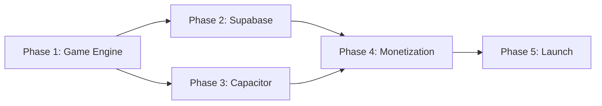

# 🏴‍☠️ PLAN: Cannon Cove — Project Plan

> Pirate-themed artillery game. Web-first, then mobile + backend.

---

## Overview

Build **Cannon Cove**, a cross-platform artillery game inspired by QBasic Gorillas with a pirate theme, using the **Game-First, Layer Up** approach (Option B from brainstorm). Each phase delivers a testable milestone.

**Total estimated timeline:** 6 weeks (Part-time) / 3 weeks (Full-time)

---

## Phase 1: Core Game Engine

> **Goal:** A fully playable single-player web game with no backend dependencies.
> **Agent:** `@game-developer` + `@frontend-specialist`
> **Duration:** ~2 weeks

### 1.1 Project Scaffold

- [x] Initialize Vite project with vanilla JS template
- [x] Set up file structure per the concept doc (`game.js`, `renderer.js`, `ai.js`, `waves.js`, `audio.js`)
- [x] Configure Canvas 2D with DPI-aware scaling and resize listener
- [x] Set up Pirata One + Inter fonts (Google Fonts)
- [x] Create base CSS with pirate color palette (`#0B1D3A`, `#F4A623`, `#8B5E3C`, `#F5F0E8`)

### 1.2 Rendering Engine (`renderer.js`)

- [x] Draw ocean background with gradient sky
- [x] Procedural wave generation (animated sine waves)
- [x] Draw pirate ships (procedural canvas — hull, mast, sails, flag)
- [x] Ship bobbing animation (position = `baseY + sin(time * freq) * amp`)
- [x] Wind flag indicator (direction + speed visualization)
- [x] Dynamic sky cycle (sunset → dusk → night over match duration)
- [x] Star field generation for night phase
- [x] Cannonball rendering with smoke trail
- [x] Splash VFX (water hit) and impact VFX (ship hit)
- [x] Ship damage states (3HP → 2HP → 1HP → sinking animation)
- [x] Rocky islands / cove scenery decoration
- [x] Easter egg: occasional whale breach or kraken tentacle in background

### 1.3 Physics & Game Logic (`game.js`)

- [x] Core game state object (players, turn, wind, round, HP)
- [x] Finite State Machine for game flow (`MENU → AIM → FIRE → RESOLVE → SWITCH_TURN → VICTORY`)
- [x] Projectile physics (gravity + wind + initial velocity)
- [x] Wave offset applied to ship Y positions for collision detection
- [x] Collision detection (cannonball vs. ship hull, water, rocks, power-up crates)
- [x] Multi-hit health system (3HP per ship)
- [x] Wind randomization per round
- [x] Turn switching logic
- [x] Victory/defeat state with celebration animation

### 1.4 Input & Controls

- [x] Mouse/trackpad: drag to set angle + power
- [x] Touch controls: same drag gesture for mobile web
- [x] Power gauge UI overlay
- [x] Angle indicator arc
- [x] Fire button

### 1.5 AI Opponent (`ai.js`)

- [x] Monte Carlo simulation (N random throws, pick closest to enemy)
- [x] Wave phase prediction (account for target ship bobbing)
- [x] Progressive difficulty (`2 + round * 3` simulations)
- [x] Named AI captains with personality (affects accuracy variance)

### 1.6 Power-Ups

- [x] Floating crate spawning (randomly between ships)
- [x] Crate collision detection
- [x] 🔴 Chain Shot — double damage on next hit
- [x] 🟢 Repair Kit — restore 1 HP
- [x] 🔵 Spyglass — show exact trajectory preview for one turn

### 1.7 Audio (`audio.js`)

- [x] Integrate Howler.js for audio management
- [x] Cannon fire SFX
- [x] Cannonball whoosh (positional)
- [x] Water splash SFX
- [x] Ship hit / wood cracking SFX
- [x] Ambient ocean loop
- [x] Victory fanfare
- [x] Wind ambient (intensity matches wind speed)

### 1.8 Game Modes

- [x] ⚔️ Duel — 1v1 vs AI (default)
- [x] 🏴‍☠️ Crew Battle — 2-player hot-seat
- [x] 👻 Ghost Fleet — AI vs AI autoplay

### 1.9 UI Screens

- [x] Main menu (title, mode selection, settings)
- [x] In-game HUD (HP bars, wind indicator, turn label, round counter)
- [x] Settings panel (sound toggle, quality)
- [x] Victory / defeat screen with stats
- [x] "How to Play" overlay

### ✅ Phase 1 Verification

| Test | Method | Pass Criteria |
|------|--------|---------------|
| Game loads | Open `localhost:5173` in browser | Canvas renders ocean, ships, sky |
| Physics accuracy | Fire at 45°, no wind — ball should arc symmetrically | Visual check + unit test |
| Wave bobbing | Ships move up/down at ~0.5Hz | Visual check |
| AI plays | Start Duel mode, wait for AI turn | AI fires within reasonable angle |
| Damage system | Hit a ship 3 times | Ship shows 3 damage states + sinks |
| Power-ups | Play 5+ turns | At least one crate should spawn |
| Touch controls | Open on mobile Safari/Chrome | Drag to aim works |
| All modes | Test Duel, Crew Battle, Ghost Fleet | All three work without errors |
| Audio plays | Fire cannon, hit ship, splash water | Sounds play at correct triggers |
| Dynamic sky | Play a full match (~10 turns) | Sky transitions from sunset to night |

---

## Phase 2: Supabase Backend

> **Goal:** Authenticated players, persistent profiles, and global leaderboard.
> **Agent:** `@backend-specialist`
> **Duration:** ~1 week

### 2.1 Supabase Project Setup

- [x] Create Supabase project
- [x] Configure auth providers (Anonymous, Google, Apple, magic link)
- [x] Set up environment variables (`VITE_SUPABASE_URL`, `VITE_SUPABASE_ANON_KEY`)

### 2.2 Database Schema

- [x] Create `players` table (id, username, avatar_url, total_wins, total_games, accuracy_pct, unlocked_skins)
- [x] Create `matches` table (id, player1_id, player2_id, winner_id, rounds, duration_seconds)
- [x] Create `leaderboard` materialized view (win_rate, rank)
- [x] Set up RLS policies (players can only update own profile, matches insert-only)
- [x] Create trigger to auto-update player stats on match insert

### 2.3 Auth Integration (`supabase.js`)

- [x] Supabase client initialization
- [x] "Play as Guest" → anonymous auth
- [x] "Sign In" → OAuth / magic link
- [x] Session persistence and token refresh
- [x] Guest-to-authenticated migration (transfer stats)

### 2.4 Game Integration

- [x] Save match results to `matches` table on game end
- [x] Update player `total_wins`, `total_games`, `accuracy_pct` after each match
- [x] Fetch and display leaderboard in UI
- [x] Cloud save: persist current game settings per player

### 2.5 Edge Functions

- [x] Anti-cheat score validation (verify match duration vs. rounds, reasonable accuracy)
- [x] Reward distribution (unlock skins at milestones)

### ✅ Phase 2 Verification

| Test | Method | Pass Criteria |
|------|--------|---------------|
| Guest auth | Click "Play as Guest" | Session created, game starts |
| OAuth auth | Click "Sign In with Google" | Redirect + session |
| Match saved | Complete a game | Row appears in `matches` table |
| Leaderboard | Win 5+ games | Player appears on leaderboard with rank |
| RLS | Try to update another player via API | Blocked by policy |
| Guest migration | Play as guest, then sign in | Stats transfer to authenticated account |

---

## Phase 3: Mobile (Capacitor)

> **Goal:** Native iOS + Android apps wrapping the web game.
> **Agent:** `@mobile-developer`
> **Duration:** ~1 week

### 3.1 Capacitor Setup

- [ ] Install Capacitor CLI and core plugins
- [ ] Configure `capacitor.config.ts` (app name, bundle ID, server settings)
- [ ] Generate iOS and Android projects
- [ ] Configure splash screen and app icons

### 3.2 Touch Optimization

- [ ] Verify drag-to-aim feels natural on touch
- [ ] Adjust hit areas for fat-finger tolerance
- [ ] Add haptic feedback on cannon fire and ship hit (`@capacitor/haptics`)
- [ ] Prevent accidental zooming / scrolling

### 3.3 Native Integrations

- [ ] `@capacitor/preferences` — local settings storage
- [ ] `@capacitor/share` — victory screenshot sharing
- [ ] `@capacitor/splash-screen` — branded loading

### 3.4 Platform Testing

- [ ] Test on iOS simulator (iPhone 15, iPad)
- [ ] Test on Android emulator (Pixel 8, Samsung Galaxy)
- [ ] Test landscape and portrait orientations
- [ ] Verify Canvas performance on mid-range devices

### ✅ Phase 3 Verification

| Test | Method | Pass Criteria |
|------|--------|---------------|
| iOS build | `npx cap run ios` | Game runs on iOS simulator |
| Android build | `npx cap run android` | Game runs on Android emulator |
| Haptics | Fire cannon on device | Phone vibrates |
| Share | Win a game, tap Share | Native share sheet opens with screenshot |
| Performance | Play full match on mid-range device | Smooth 60fps, no frame drops |

---

## Phase 4: Monetization

> **Goal:** Ad placements + in-app purchases + web payments.
> **Agent:** `@backend-specialist` + `@mobile-developer`
> **Duration:** ~1 week

### 4.1 AdMob (`ads.js`)

- [ ] Install `@capacitor-community/admob`
- [ ] Rewarded video: "Watch to get power-up" prompt
- [ ] Rewarded video: "Watch for second chance" on defeat
- [ ] Interstitial: every 3rd game, after victory/defeat
- [ ] Banner: main menu only (never in gameplay)

### 4.2 In-App Purchases (`iap.js`)

- [ ] Install RevenueCat (`capacitor-purchases`)
- [ ] Ship Skin Pack ($1.99) — 5 hull/sail designs
- [ ] Cannon Effects ($0.99) — fire, ice, lightning trails
- [ ] Flag Collection ($0.99) — custom pirate flags
- [ ] Remove Ads ($2.99) — removes interstitials + banners
- [ ] Captain's Bundle ($4.99) — everything
- [ ] Unlock persistence via Supabase `unlocked_skins` jsonb

### 4.3 Stripe (Web)

- [ ] Stripe checkout for "Remove Ads" (web players)
- [ ] Stripe checkout for cosmetic bundles (web players)
- [ ] Webhook → Supabase Edge Function to update player purchases

### ✅ Phase 4 Verification

| Test | Method | Pass Criteria |
|------|--------|---------------|
| Rewarded video | Tap "Get Power-Up" | Ad plays → power-up granted |
| Interstitial | Play 3 games | Interstitial shows after 3rd match |
| IAP flow | Tap "Ship Skins" in store | RevenueCat purchase sheet appears |
| Remove Ads | Purchase "Remove Ads" | Interstitials and banners disappear |
| Stripe web | Click "Buy Skins" on web | Stripe checkout → purchase recorded |
| No pay-to-win | Review all purchasable items | All items are cosmetic or ad-removal only |

---

## Phase 5: Launch Prep

> **Goal:** App store submissions, marketing activation, community setup.
> **Agent:** `@project-planner`
> **Duration:** ~1 week

### 5.1 App Store Submissions

- [ ] iOS App Store: screenshots, description, keywords, privacy policy
- [ ] Google Play Store: screenshots, description, content rating, privacy policy
- [ ] Web: deploy to custom domain via Netlify

### 5.2 Marketing Activation

- [ ] Product Hunt listing (GIF demos, tech stack angle)
- [ ] Hacker News "Show HN" post
- [ ] 𝕏 launch thread with dev journey + playable link
- [ ] Reddit posts (r/webdev, r/gamedev, r/indiegaming)
- [ ] Dev.to article: *"I Rebuilt QBasic Gorillas as a Pirate Game with Vanilla JS"*

### 5.3 Content Pipeline

- [ ] YouTube tutorial series outline (8–10 episodes)
- [ ] Record Episode 1: Project setup + first canvas render
- [ ] CodePen / JSFiddle embeddable version

### 5.4 Community

- [ ] Discord server setup (channels: general, high-scores, ship-designs, bugs)
- [ ] GitHub repo cleanup (README, LICENSE, CONTRIBUTING.md)
- [ ] Itch.io page for indie gaming audience

---

## Agent Assignments Summary

| Phase | Primary Agent | Supporting |
|-------|---------------|------------|
| Phase 1: Game Engine | `@game-developer` | `@frontend-specialist` |
| Phase 2: Backend | `@backend-specialist` | `@security-auditor` |
| Phase 3: Mobile | `@mobile-developer` | `@frontend-specialist` |
| Phase 4: Monetization | `@backend-specialist` | `@mobile-developer` |
| Phase 5: Launch | `@project-planner` | `@seo-specialist` |

---

## Risk Register

| Risk | Impact | Mitigation |
|------|--------|------------|
| Canvas perf on low-end mobile | Players churn | Profile early, reduce draw calls, use `offscreenCanvas` for static elements |
| WebView audio autoplay blocked | No sound = bad UX | Howler.js handles unlocking; add initial user interaction gate |
| AdMob review rejection | Launch delay | Follow AdMob policies strictly; test with test ads first |
| App Store review rejection | Launch delay | Submit early for review; keep first build simple |
| AI too hard / too easy | Players quit | Monte Carlo sim count scales with rounds; add difficulty setting as fallback |

---

## Dependencies

> [!NOTE]
> Phase 2 (Supabase) and Phase 3 (Capacitor) can run in parallel after Phase 1 is complete.

---

*✅ Plan created. Next steps: review this plan, then run `/create` to start Phase 1 implementation.*
